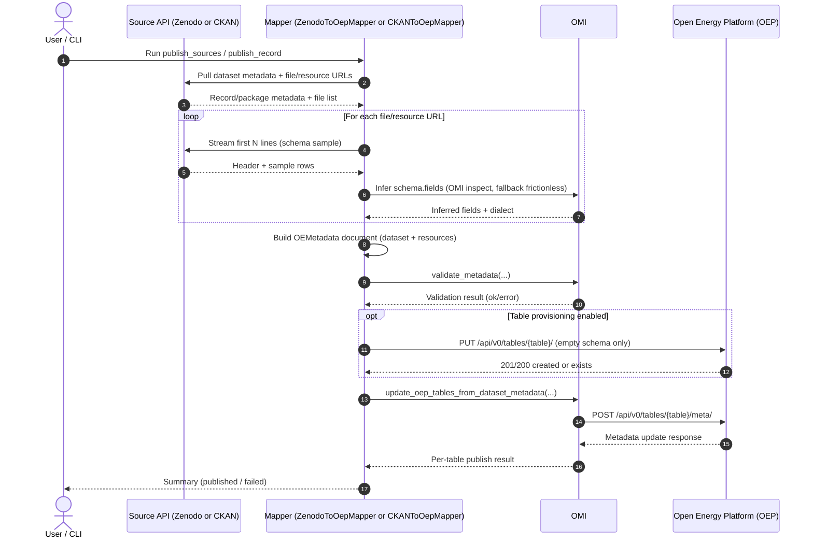
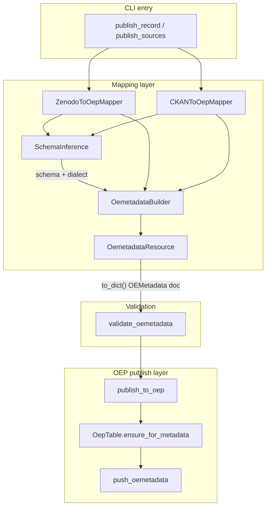
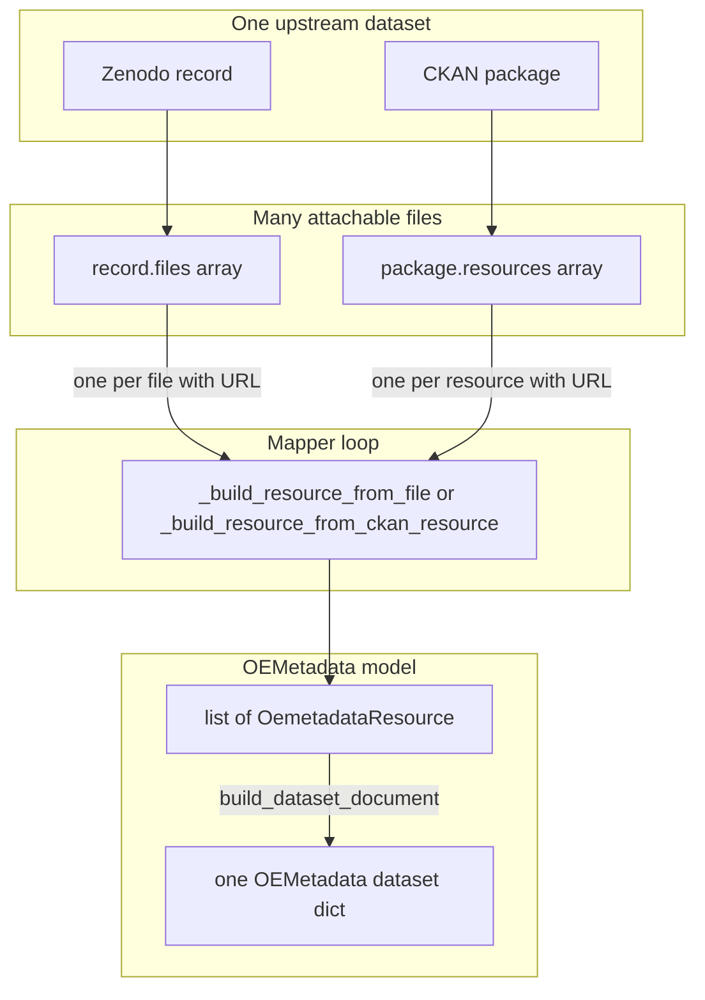
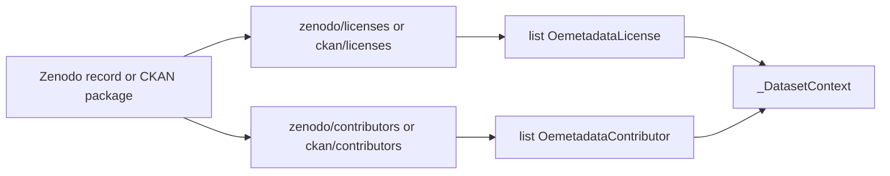
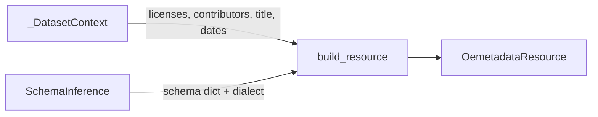
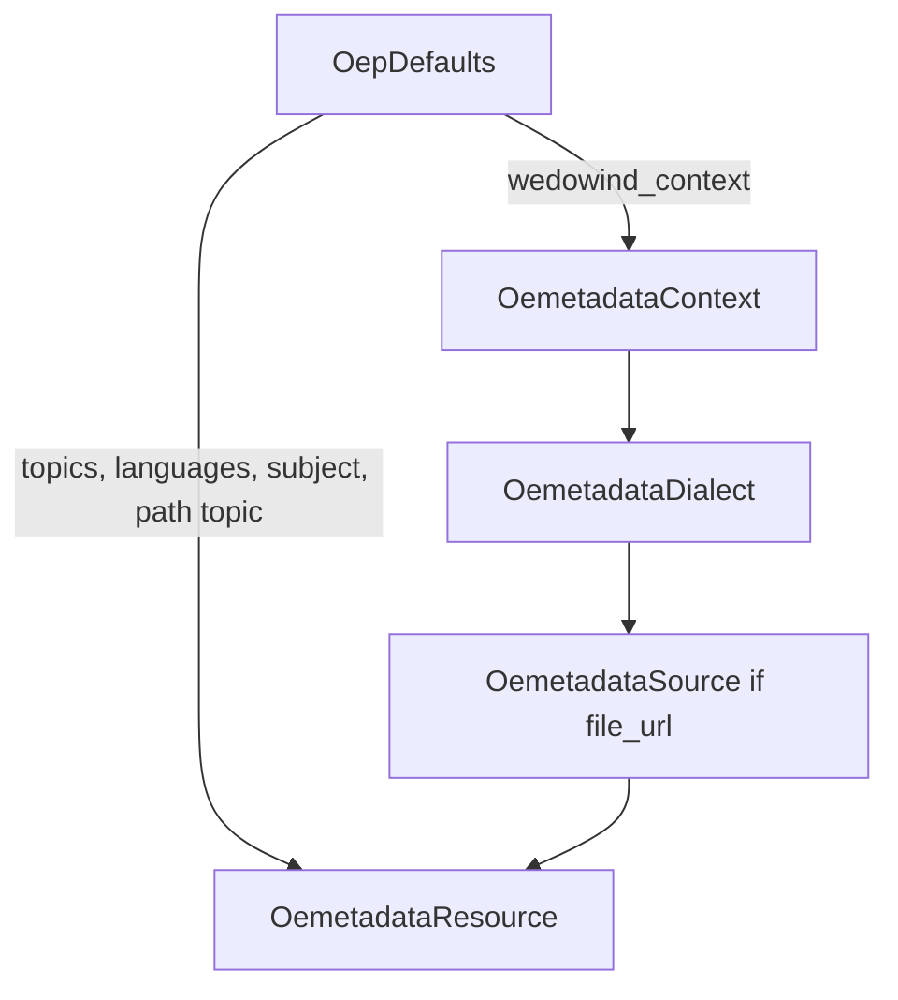
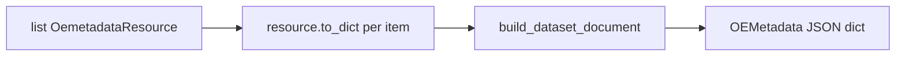
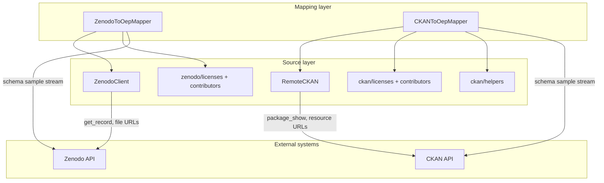

# wedowind

Research Data Infrastructure for the WeDoWind community — publish wind-related dataset metadata from Zenodo and CKAN to the [Open Energy Platform](https://openenergyplatform.org) (OEP) using [OEMetadata](https://github.com/OpenEnergyPlatform/oemetadata) and [OMI](https://github.com/OpenEnergyPlatform/omi).

## Table of contents

- [wedowind](#wedowind)
  - [Table of contents](#table-of-contents)
  - [Setup](#setup)
  - [Publish to OEP](#publish-to-oep)
    - [Zenodo (configured sources)](#zenodo-configured-sources)
    - [Zenodo (single record)](#zenodo-single-record)
    - [CKAN (configured sources)](#ckan-configured-sources)
    - [CKAN (single dataset)](#ckan-single-dataset)
  - [How it works](#how-it-works)
    - [Architecture (class objects - simplified)](#architecture-class-objects---simplified)
    - [Pipeline](#pipeline)
    - [OEMetadata composition](#oemetadata-composition)
      - [Phase 0 — Overview](#phase-0--overview)
      - [Phase 1 — Dataset-level (record/package) context extraction](#phase-1--dataset-level-recordpackage-context-extraction)
      - [Phase 2 — One schema inference per file/resource](#phase-2--one-schema-inference-per-fileresource)
      - [Phase 2 — detailed build resource](#phase-2--detailed-build-resource)
      - [Phase 3 — Dataset document](#phase-3--dataset-document)
      - [Source integration](#source-integration)
  - [Configuration](#configuration)
  - [Automation](#automation)
  - [CLI flags](#cli-flags)

## Setup

```bash
uv sync
```

Optional pre-commit hooks:

```bash
uv sync --group dev
uv run pre-commit install
```

Copy `.env.dist` to `.env` and set `OEP_API_TOKEN` (and optionally `ZENODO_ACCESS_TOKEN` for higher Zenodo API limits).

## Publish to OEP

### Zenodo (configured sources)

```bash
uv run python -m mappers.zenodo.publish_sources --dry-run
uv run python -m mappers.zenodo.publish_sources
```

### Zenodo (single record)

```bash
uv run python -m mappers.zenodo.publish_record --dataset-id "<zenodo-id>" --dry-run
```

### CKAN (configured sources)

```bash
uv run python -m mappers.ckan.publish_sources --dry-run
uv run python -m mappers.ckan.publish_sources
```

### CKAN (single dataset)

```bash
uv run python -m mappers.ckan.publish_record \
  --ckan-url "https://energydata.info/en" \
  --dataset-id "<package-name>" \
  --dry-run
```

## How it works

For each file in a Zenodo record or CKAN resource:

1. **Infer schema** — stream the first 2 lines from the **source download URL** (not stored on disk); OMI/Frictionless infers `schema.fields`.
2. **Create empty OEP table** — `PUT /api/v0/tables/{name}/` with column definitions only (no data rows uploaded to OEP).
3. **Push metadata** — `POST /api/v0/tables/{name}/meta/` with full OEMetadata via OMI.



### Architecture (class objects - simplified)

### Pipeline

Internal wedowind layers from CLI through OEP publish:



For how typed OEMetadata objects are assembled before validation, see **OEMetadata composition (Phase 0)** below.

### OEMetadata composition

[`OemetadataBuilder`](src/mappers/oep/oemetadata_builder.py) and dataclasses in [`oemetadata.py`](src/mappers/oep/oemetadata.py); entry points [`ZenodoToOepMapper.map_to_oemetadata`](src/mappers/zenodo/oep_mapper.py) and [`CKANToOepMapper.map_to_oemetadata`](src/mappers/ckan/oep_mapper.py).

#### Phase 0 — Overview

One **OEMetadata dataset** corresponds to one upstream dataset - record in Zenodo, package in CKAN. 

Each **OEMetadata resource** (one OEP table) corresponds to one attachable file (Zenodo) /resource (CKAN).

| Source | One OEMetadata dataset | One OEMetadata resource |
|--------|------------------------|-------------------------|
| Zenodo | One record (`get_record`) - multiple files | One entry in `record.files[]` with a download URL. Requires a non-empty `files` list |
| CKAN | One package (`package_show`) - multiple resources | One entry in `package.resources[]` with a URL. Skips resources without a URL |

The mapper builds dataset-level fields **once** (`_ZenodoDatasetContext` / `_CkanDatasetContext`), **loops** over mappable files or resources and calls `build_resource` per item, then wraps the resulting `list[OemetadataResource]` in `build_dataset_document`. 



#### Phase 1 — Dataset-level (record/package) context extraction

Once per `map_to_oemetadata`, before the per-file (Zenodo) / per-resource (CKAN) loop: `_build_dataset_context` loads licenses, contributors, title, dates, and keywords shared by every file/resource.



#### Phase 2 — One schema inference per file/resource

For each mappable file (Zenodo) or resource (CKAN): stream a sample, infer `schema` and dialect, then `build_resource` → one `OemetadataResource`.



#### Phase 2 — detailed build resource

Inside [`build_resource`](src/mappers/oep/oemetadata_builder.py), called once per Zenodo file or CKAN resource. [`OepDefaults`](src/mappers/oep/oep_defaults.py) (from source config and CLI flags) is passed in on every call.

1. **Context** — `wedowind_context(oep)` → `OemetadataContext` (publisher from `OepDefaults`)
2. **Dialect** — schema-inference dialect → `OemetadataDialect`
3. **Provenance (optional)** — if `file_url` is set → `OemetadataSource` (`source_licenses` reuses the Phase 1 license list)
4. **Assemble** → `OemetadataResource` (steps 1–3, Phase 1 licenses/contributors, `schema`, `table_name`, `path` from `oep.topic`, plus `topics` / `languages` / `subject` from `OepDefaults`)



OEMetadata defines `resources[].licenses` (this OEP table) and `sources[].sourceLicenses` (the upstream file). Zenodo and CKAN expose one license per record/package, so wedowind uses the same Phase 1 list for both.

| Field / child object | Source |
|----------------------|--------|
| `name` | `table_name` from mapper (`OepTable.build_oep_table_name`) |
| `path` | `oep_resource_path(oep.topic, table_name)` |
| `context` | `OemetadataContext` |
| `dialect` | `OemetadataDialect` |
| `sources[]` | optional `OemetadataSource` from `file_url` |
| `licenses` | `OemetadataLicense` list on resource; same list as `source_licenses` |
| `contributors` | Phase 1 — `OemetadataContributor` list |
| `schema` | Phase 2 — schema inference for this file, or empty placeholder |
| `title`, `description`, `publication_date`, `keywords` | Mapper args (often from dataset context) |
| `topics`, `languages`, `subject` | `OepDefaults` |

#### Phase 3 — Dataset document

After the loop: `build_dataset_document` runs `to_dict()` on each resource and adds dataset-level fields and `metaMetadata`.



Then `validate_oemetadata` and `publish_to_oep` (see Pipeline diagram above).

#### Source integration

How each mapper reaches Zenodo or CKAN:



See [`README_incompatibilities.md`](README_incompatibilities.md) for field mapping gaps and limitations.

## Configuration

- Zenodo: [`src/mappers/zenodo/config/sources.json`](src/mappers/zenodo/config/sources.json), [`src/mappers/zenodo/README.md`](src/mappers/zenodo/README.md)
- CKAN: [`src/mappers/ckan/config/sources.json`](src/mappers/ckan/config/sources.json), [`src/mappers/ckan/README.md`](src/mappers/ckan/README.md)

OEP defaults (`topic`, `table_prefix`, `infer_schema`, …) live under `defaults.oep` (Zenodo) or per-source `oep` (CKAN).

## Automation

Monthly workflow: [`.github/workflows/oep-publish.yml`](.github/workflows/oep-publish.yml)

## CLI flags

| Flag | Effect |
|------|--------|
| `--dry-run` | Map + validate; log table provisioning; no OEP writes |
| `--no-infer-schema` | Skip source file sampling |
| `--no-provision-tables` | Skip empty table creation |
| `--schema-sample-lines N` | Lines to stream per source file (default 2) |
| `--skip-validation` | Skip OMI JSON Schema check |
