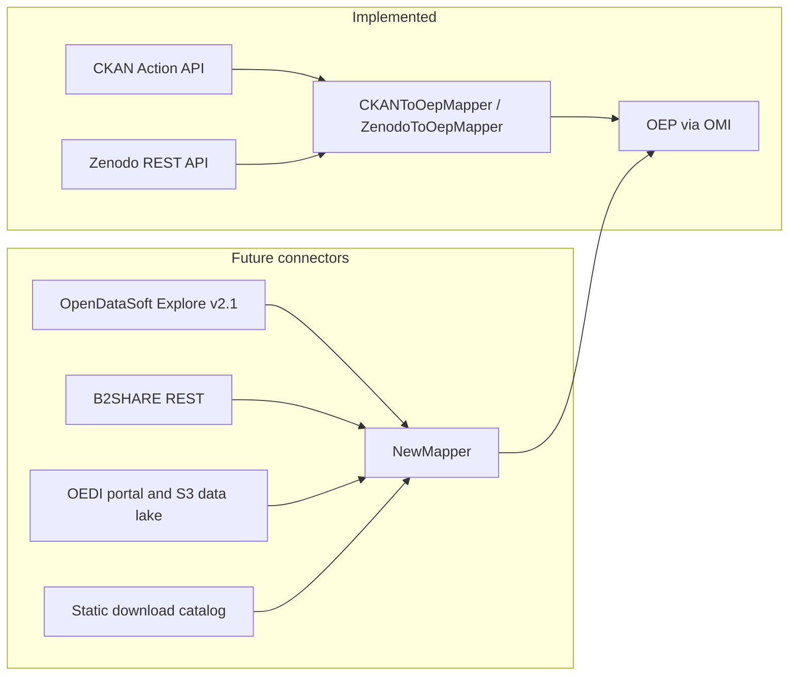

# Future source connectors

Assessment of candidate wind-related data sources for integration with wedowind. This document answers whether each portal exposes a **CKAN Action API** (usable by the existing [`mappers.ckan`](src/mappers/ckan/) pipeline) and, if not, which connector pattern fits instead.

**Implemented today:** Zenodo and CKAN only — see [README.md](README.md).

**Related:** field-level mapping gaps for Zenodo/CKAN → OEP are in [README_incompatibilities.md](README_incompatibilities.md).

---

## How wedowind connects sources today

| Connector | Config | API client | Publish entrypoint |
|-----------|--------|------------|-------------------|
| **CKAN** | [`src/mappers/ckan/config/sources.json`](src/mappers/ckan/config/sources.json) | `ckanapi.RemoteCKAN` — `package_search` / `package_show` | `uv run python -m mappers.ckan.publish_sources` |
| **Zenodo** | [`src/mappers/zenodo/config/sources.json`](src/mappers/zenodo/config/sources.json) | Zenodo REST ([`client.py`](src/mappers/zenodo/client.py)) | `uv run python -m mappers.zenodo.publish_sources` |

Both mappers:

1. Discover datasets from the source API (or configured queries).
2. Stream tabular files from **remote download URLs** (not stored on disk).
3. Infer schema, provision empty OEP tables, and push OEMetadata via OMI.

Any new source must support the same flow: **discover → file URLs → OEMetadata**.



Shared building blocks for new mappers: [`oemetadata_builder.py`](src/mappers/oep/oemetadata_builder.py), schema inference, [`publish_to_oep`](src/mappers/oep/api.py), and checkpoints in [`checkpoint_state.py`](src/mappers/checkpoint_state.py).

---

## Summary

| Source | Organization | CKAN API? | Actual access | Proposed wedowind connector |
|--------|----------------|-----------|---------------|----------------------------|
| Master Data Register of Wind Turbines | Danish Energy Agency (ENS) | **No** | Excel/GIS downloads on [ens.dk](https://ens.dk/en/analyses-and-statistics/overview-energy-sector); reporting API is separate | Static catalog or ENS file mapper |
| Monthly electricity supply statistics | Danish Energy Agency (ENS) | **No** | Spreadsheet downloads from [annual/monthly statistics](https://ens.dk/en/analyses-and-statistics/annual-and-monthly-statistics) | Same as above |
| Tall Tower Dataset | BSC | **No** | Web catalog + [B2SHARE](https://b2share.eudat.eu/) files | New `mappers.b2share` (Zenodo-like) |
| Wind power estimation/forecast (BE grid) | Elia | **No** | [OpenDataSoft Explore API v2.1](https://opendata.elia.be/api/explore/v2.1/console) | New `mappers.opendatasoft` |
| Wind Energy (research areas) | NREL OEDI / OpenEI | **No** (public CKAN paths return 404) | Custom portal + cloud data lake | New `mappers.oedi` |

*API probes: June 2026.*

---

## Per-source details

### Danish Energy Agency — Master Data Register of Wind Turbines

| | |
|---|---|
| **Portal** | [Overview of the energy sector](https://ens.dk/en/analyses-and-statistics/overview-energy-sector) |
| **Often confused with** | [api.selvbetjening.ens.dk](https://api.selvbetjening.ens.dk/index.html) |
| **CKAN?** | **No** |

`api.selvbetjening.ens.dk` is an OpenAPI **reporting** service (FacilityOwner / GridCompany APIs): JWT login (`POST /api/v1/authentication/login`), then measurement endpoints for actors in the [Selvbetjeningsportal](https://ens.dk/indberetninger/selvbetjeningsportal) (application + MitID Erhverv). It is **not** a public open-data catalog for the wind register.

The register itself is published as **direct downloads** (Excel full database, GIS shapefiles) from [Download GIS files](https://ens.dk/analyser-og-statistik/download-gis-filer) and related ENS statistics pages, updated monthly.

#### Danish Energy Agency — Monthly electricity supply statistics

| | |
|---|---|
| **Portal** | [Annual and monthly statistics](https://ens.dk/en/analyses-and-statistics/annual-and-monthly-statistics) |
| **CKAN?** | **No** |

Same pattern as the wind register: tables on ens.dk link to **downloadable spreadsheets**, not CKAN `package_search`. `api.selvbetjening.ens.dk` is unrelated for consumers of these statistics.

---

### BSC — Tall Tower Dataset

| | |
|---|---|
| **Portal** | [Access the data](https://talltowers.bsc.es/access-the-data) |
| **CKAN?** | **No** |

The site is a filterable **catalog UI**; each tower points to **“Access to data: b2share”**. Files and metadata live on EUDAT B2SHARE:

- Search: `GET https://b2share.eudat.eu/api/records?q=...`
- Record: `GET https://b2share.eudat.eu/api/records/{id}`

See [B2SHARE HTTP REST API](https://docs.eudat.eu/b2share/httpapi/).

**Proposed connector:** `mappers.b2share` modeled on Zenodo (`config/sources.json`, `client.py`, `oep_mapper.py`, `publish_sources`). Curate B2SHARE record IDs from the Tall Tower catalog (scrape or maintained list). Public records need no token; register only for restricted data.

---

### Elia — Open Data Elia (wind, power generation)

| | |
|---|---|
| **Portal** | [opendata.elia.be](https://opendata.elia.be/pages/home/) — [Wind under Power generation](https://opendata.elia.be/explore/?refine.theme=Power+generation&refine.keyword=Wind) |
| **CKAN?** | **No** — `GET .../api/3/action/site_read` → 404 |
| **Actual API** | **Opendatasoft Explore v2.1** — base URL `https://opendata.elia.be/api/explore/v2.1` |
| **Cost** | **Free** read access (HTTP GET, JSON). Optional API key for higher quotas. |

Useful endpoints:

- `GET /catalog/datasets` — catalog (ODSQL `where=`, facets)
- `GET /catalog/datasets/{dataset_id}/records` — tabular records (paginated)
- `GET /catalog/datasets/{dataset_id}/exports/csv` — full export without row cap

Example wind dataset IDs (keyword search): `ods086` (near real-time), `ods031` (historical).

```bash
# Elia: OpenDataSoft responds
curl -s "https://opendata.elia.be/api/explore/v2.1/catalog/datasets?limit=1" | head
```

**Proposed connector:** `mappers.opendatasoft` with `base_url`, `dataset_id` list or catalog queries, map `metas.default` → OEMetadata, use export URLs for schema inference.

---

### NREL — Open Energy Data Initiative (OEDI)

| | |
|---|---|
| **Portal** | [data.openei.org](https://data.openei.org/) — [Wind Energy search](https://data.openei.org/search?ra[]=Wind+Energy) |
| **Services / keys** | [openei.org/services](https://openei.org/services/) (OpenEI REST, e.g. `api.openei.org`) |
| **CKAN?** | **Not on public endpoints** — `https://data.openei.org/api/3/action/package_search` and `site_read` return **404** (June 2026) |

OEDI is a **custom web portal** (submission pages, S3 viewer) plus a **cloud data lake** ([open-data-access-tools](https://github.com/openEDI/open-data-access-tools), AWS `oedi-data-lake`). OpenEI REST services cover utilities/rates and related topics; they do **not** enumerate OEDI dataset packages like CKAN.

Submitter documentation ([submission 11](https://data.openei.org/submissions/11)) mentions metadata harvesting for federation; confirm the live harvesting API in the PDF before implementing.

---

## Potential implementations

1. **Elia (OpenDataSoft)** — stable REST, public, wind datasets identified.
2. **BSC (B2SHARE)** — good REST metadata; needs curated record IDs from the Tall Tower catalog.

##  Complex implementations 

1. **OEDI** — highest effort (portal + S3); confirm harvest API from NREL docs.
2. **Danish ENS** — lowest automation ROI unless metadata stubs pointing at stable download URLs are enough.

---

## References

- [CKAN API guide](https://docs.ckan.org/en/latest/api/)
- [Opendatasoft Explore API v2.1](https://help.opendatasoft.com/apis/ods-explore-v2/explore_v2.1.html)
- [B2SHARE REST API](https://docs.eudat.eu/b2share/httpapi/)
- [OEDI open-data-access-tools](https://openedi.github.io/open-data-access-tools/)
