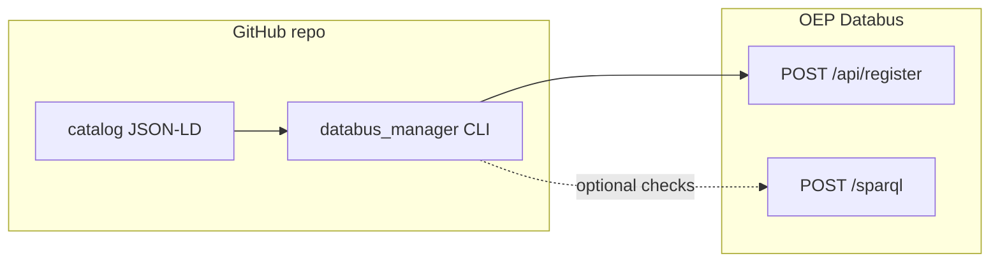

# Databus catalog (Open Energy Platform)

This folder holds **JSON-LD** descriptions for your WeDoWind Databus catalog. A Python package [`databus_manager`](../src/databus_manager/) under `src/` walks the same structure and (when extended) registers metadata with the OEP Databus API.

- **User guide (this file):** layout, flow, GitHub setup, logs, endpoints, troubleshooting.  
- **Project overview:** see the [root README](../README.md).

## Layout

```text
catalog/
├── README.md
├── group-<slug>/
│   ├── group-metadata.jsonld          # Group document (@graph)
│   ├── artefacts-1/
│   │   ├── artefact-metadata.jsonld   # Artifact document
│   │   ├── version-1/
│   │   │   └── version.jsonld         # Version — POST body shape for /api/register
│   │   └── version-2/
│   │       └── version.jsonld
│   └── artefacts-2/
│       └── ...
└── ...
```

Conventions:

- **Folder names** (`group-<slug>`, `artefacts-*`, `version-*`) should stay aligned with the IRIs you use in `@id` (account/group/artefact/version segments).
- **Filenames** are fixed so automation can find them: `group-metadata.jsonld`, `artefact-metadata.jsonld`, `version.jsonld`.

Two example groups ship with this repo: `group-zenodo/` and `group-the-world-bank-group/`, each with `artefacts-1`, `artefacts-2`, and two version folders per artefact.

## End-to-end flow

1. **Edit JSON-LD** under `catalog/` (download URLs, titles, `@id` values). Data files are **not** uploaded by CI; `distribution[].downloadURL` must already point at a public landing page or file.
2. **Run the sync locally** (dry run by default). Dependencies are managed with [uv](https://docs.astral.sh/uv/); from the repo root:

   ```bash
   uv sync
   uv run python -m databus_manager --catalog catalog
   ```

3. **Inspect logs** in `catalog/.databus/logs/` (see [Log files](#log-files)).
4. **Implement** the `register_*` stubs in `src/databus_manager/` when you are ready to call the live API.
5. **Enable real POSTs** with `--apply` and a `DATABUS_API_KEY` (see below).
6. **GitHub Actions** (`.github/workflows/databus-publish.yml`) runs the same CLI on pushes that touch the catalog or tooling and uploads log artifacts.



## Open Energy Platform endpoints

| Purpose | URL |
|--------|-----|
| JSON-LD context | `https://databus.openenergyplatform.org/res/context.jsonld` |
| Register metadata | `https://databus.openenergyplatform.org/api/register` |
| SPARQL | `https://databus.openenergyplatform.org/sparql` |

Register requests use **`Content-Type: application/json`** and header **`X-API-KEY`**. The JSON document uses `@context` + `@graph` as in your working `curl` example.

## GitHub Actions and secrets

1. In the repository **Settings → Secrets and variables → Actions**, add:

   - **`DATABUS_API_KEY`** — API key for `X-API-KEY` on `/api/register`.

2. The workflow **`.github/workflows/databus-publish.yml`** runs `uv sync --frozen` and:

   ```bash
   uv run python -m databus_manager --catalog catalog
   ```

   By default the CLI is a **dry run** (no HTTP).    After you implement `register_group`, `register_artefact`, and `register_version`, switch the workflow step to:

   ```bash
   uv run python -m databus_manager --catalog catalog --apply
   ```

3. After each run, download the **`databus-logs-*`** artifact for `catalog/.databus/logs/`.

### Local run before push ([wrkflw](https://github.com/bahdotsh/wrkflw))

You can **validate and execute** this workflow on your machine with [wrkflw](https://github.com/bahdotsh/wrkflw) (see its [README](https://github.com/bahdotsh/wrkflw#readme) for install: `brew install wrkflw` or `cargo install wrkflw`).

```bash
# Syntax / structure check
wrkflw validate .github/workflows/databus-publish.yml

# Run the workflow locally (choose a runtime)
wrkflw run --runtime emulation --event workflow_dispatch .github/workflows/databus-publish.yml
```

Optional: pass a dummy key so the job step sees the same env name as on GitHub (the CLI still dry-runs unless you add `--apply`):

```bash
export DATABUS_API_KEY="local-test-not-for-production"
wrkflw run --runtime emulation --event workflow_dispatch .github/workflows/databus-publish.yml
```

If wrkflw’s **strict trigger filter** complains when simulating `push` / `pull_request`, either simulate **`workflow_dispatch`** (this workflow supports it and does not gate on `paths:` for that event), or use diff-aware flags from the [wrkflw docs](https://github.com/bahdotsh/wrkflw/blob/main/README.md#trigger-aware-execution), for example:

```bash
wrkflw run --runtime emulation --diff --event push --changed-files catalog/README.md,pyproject.toml \
  .github/workflows/databus-publish.yml
```

**Caveats:** wrkflw is an emulator—behavior is close but not identical to GitHub (see **“Not yet supported”** in the upstream README: e.g. `concurrency:` is parsed but not enforced; Linux-focused runner emulation). Use **Docker** (`wrkflw run`, default runtime) for the closest match if you have Docker; **`--runtime emulation`** is convenient when you only want a quick smoke test.

## Python package (`src/databus_manager/`)

| Module | Role |
|--------|------|
| [`common_core.py`](../src/databus_manager/common_core.py) | Shared discovery (`find_child_dirs_with_metadata`), JSON-LD load (`load_jsonld_file`), stub register responses (`stub_register_metadata_result`). |
| [`cli.py`](../src/databus_manager/cli.py) | Orchestrates discovery order: groups → artefacts → versions → discrepancies → writes reports. |
| [`groups.py`](../src/databus_manager/groups.py) | Find `group-metadata.jsonld`, extension point for register. |
| [`artefacts.py`](../src/databus_manager/artefacts.py) | Find `artefacts-*` / `artefact-metadata.jsonld`. |
| [`versions.py`](../src/databus_manager/versions.py) | Find `version-*` / `version.jsonld` (Version POST payload). |
| [`discrepancies.py`](../src/databus_manager/discrepancies.py) | Compare local vs remote metadata (stub — implement SPARQL / canonical RDF diff). |
| [`logging_utils.py`](../src/databus_manager/logging_utils.py) | Writes JSON / JSONL logs under `catalog/.databus/logs/`. |

Run:

```bash
uv run python -m databus_manager --help
```

## Log files

Written under **`catalog/.databus/logs/`** (created on run). The repository **ignores** this path in `.gitignore` so local runs do not create noisy commits; use **CI artifacts** or copy logs where you need them. Remove the ignore entry if you prefer to version a publish ledger (`publish_log.jsonl`).

| File | Description |
|------|-------------|
| `run_report_<id>.json` | Full discovery tree and config snapshot for the run. |
| `run_summary_<id>.md` | Short Markdown summary for quick reading. |
| `discrepancies.json` | Populated by **`discrepancies`** once you implement remote fetch + diff. |
| `failed_upload.json` | Intended for skipped publishes (duplicate on Databus, validation errors). Stub ships with an empty `entries` list. |
| `publish_log.jsonl` | Append when you implement successful POSTs — one JSON object per published entity (ledger). |

Prefer **verbose JSON** with indentation for human review; optional **JSON Schema** files can live in [`src/databus_manager/schemas/`](../src/databus_manager/schemas/).

## Troubleshooting

| Symptom | What to check |
|--------|----------------|
| `401` / `403` on register | `DATABUS_API_KEY` secret, header name `X-API-KEY`, and account permissions on OEP Databus. |
| Wrong resource created | `@id` IRIs in JSON-LD must match your Databus account and group/artefact/version paths. |
| Duplicate version errors | Another user may have registered the same version via the UI; implement SPARQL existence checks before POST (see stubs). |
| `catalog not found` | Run CLI from repo root or pass `--catalog` explicitly. |
| Empty discrepancies | Expected until `discrepancies.check_catalog_vs_remote` is implemented and a publish ledger exists. |

## References

- [Databus CI / SPARQL patterns](https://dbpedia.gitbook.io/databus/usage/ci) (same ideas; your host is OEP, not dbpedia.org).
