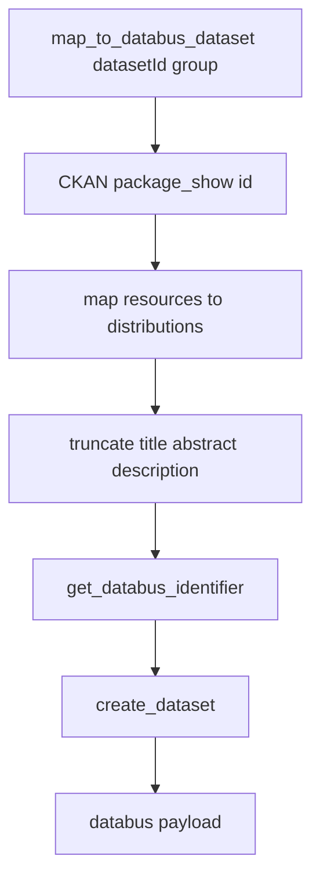

# CKAN Mapper

The CKAN mapper converts one CKAN dataset (`package_show`) into one Databus dataset payload.

## Contents

- [Commands](#commands)
- [API Flow Sketch](#api-flow-sketch)
- [Config Files](#config-files)
- [Configured sources](#configured-sources)

## Commands

Publish all datasets matched by configured CKAN `package_search` queries (see `config/sources.json`):

```bash
uv run python -m mappers.ckan.publish_sources
```

Pre-publish readiness check (no Databus push):

```bash
uv run python -m mappers.ckan.publish_sources --dry-run
```

Each query entry may include a `package_search` object (passed to CKAN `package_search`). Optional CLI: `--source-id` to run one top-level registry source only; `--overlap-hours` (default 24) aligns with the Zenodo sources publisher.

Publish one CKAN dataset (single `package_show`):

```bash
uv run python -m mappers.ckan.publish_record \
  --ckan-url "<ckan-base-url>" \
  --dataset-id "<ckan-dataset-id>" \
  --group-name "<group-slug>" \
  --group-title "<group-title>" \
  --group-abstract "<group-abstract>" \
  --group-description "<group-description>" \
  --source-id "world-bank-group" \
  --query-id "wind-topic-datasets"
```

Pre-publish readiness check:

```bash
uv run python -m mappers.ckan.publish_record \
  --ckan-url "<ckan-base-url>" \
  --dataset-id "<ckan-dataset-id>" \
  --group-name "<group-slug>" \
  --group-title "<group-title>" \
  --group-abstract "<group-abstract>" \
  --group-description "<group-description>" \
  --source-id "world-bank-group" \
  --query-id "wind-topic-datasets" \
  --dry-run
```

## API Flow Sketch



## Config Files

- `src/mappers/ckan/config/sources.json` — registry JSON (`sources` → each CKAN endpoint’s `group`, `api`, and `queries`).
- `src/mappers/ckan/config/timestamp.json` — per source id and query id: checkpoint fields (`last_run_at`, `last_seen_updated`, `last_seen_dataset_id`, `processed_dataset_ids`; CKAN stores dataset **names** as ids). Same schema as Zenodo timestamps; see [`checkpoint_state.py`](../checkpoint_state.py).

Loading and merging these files is implemented in [`manage_sources.py`](manage_sources.py).

## Configured sources

Current default top-level source is `world-bank-group`, with queries including:

- wind topic datasets collection
- wind speed and wind power potential maps collection
- CKAN API docs reference: `https://energydata.info/en/api/1/util/snippet/api_info.html?resource_id=82bbbe64-9de6-4844-87c7-5c5aee1e5edf&datastore_root_url=https%3A%2F%2Fenergydata.info%2Fapi%2Faction`

Add more CKAN catalogs as new keys under `sources`, each with its own `group`, `api`, and `queries` list.
