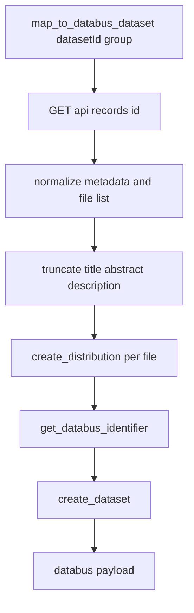
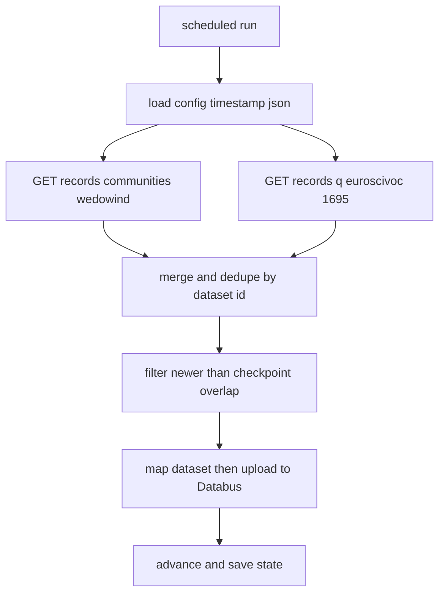

# Zenodo Mapper

This mapper converts Zenodo datasets (via the Zenodo ``/api/records`` API) into Databus dataset payloads and publishes either one dataset or all configured source feeds.

## Contents

- [Zenodo Mapper](#zenodo-mapper)
  - [Contents](#contents)
  - [Commands](#commands)
  - [API Calls](#api-calls)
  - [Mapper Flow](#mapper-flow)
  - [Sync Flow](#sync-flow)
  - [Timestamp Location](#timestamp-location)
  - [Source Configuration](#source-configuration)
  - [Add A New Source](#add-a-new-source)
  - [Zenodo Query Params Notes](#zenodo-query-params-notes)

## Commands

Publish all configured Zenodo sources (uses built-in `wedowind/zenodo` group defaults):

```bash
uv run python -m mappers.zenodo.publish_sources
```

Pre-publish readiness check (no Databus push):

```bash
uv run python -m mappers.zenodo.publish_sources --dry-run
```

Single-dataset publish (manual override mode; Zenodo still exposes ``GET /api/records/{id}``):

```bash
uv run python -m mappers.zenodo.publish_record \
  --dataset-id "<zenodo-numeric-id>" \
  --group-name "<group-slug>" \
  --group-title "<group-title>" \
  --group-abstract "<group-abstract>" \
  --group-description "<group-description>"
```

## API Calls

- `GET https://zenodo.org/api/records/{id}` for single-dataset mapping (Zenodo API names this a record).
- `GET https://zenodo.org/api/records` for source monitoring:
  - source-specific params are loaded from `src/mappers/zenodo/config/sources.json`

## Mapper Flow



## Sync Flow



## Timestamp Location

Sync state is persisted at:

- `src/mappers/zenodo/config/timestamp.json`

## Source Configuration

Configured sources are read from:

- `src/mappers/zenodo/config/sources.json`

Current structure:

```json
{
  "defaults": {
    "group": {
      "name": "wedowind/zenodo",
      "title": "Zenodo Wind Energy",
      "abstract": "All datasets on zenodo related to wind energy.",
      "description": "All datasets on zenodo related to wind energy."
    }
  },
  "sources": {
    "community_wedowind": {
      "communities": "wedowind"
    },
    "subject_euroscivoc_1695": {
      "q": "metadata.subjects.id:\"euroscivoc:1695\""
    }
  }
}
```

## Add A New Source

1. Add a new source key under `sources` in `src/mappers/zenodo/config/sources.json`.
2. Set one or more Zenodo `/api/records` query parameters for that source.
3. Add the same key to `src/mappers/zenodo/config/timestamp.json` using this shape:

```json
"your_source_key": {
  "last_run_at": null,
  "last_seen_updated": null,
  "last_seen_dataset_id": null,
  "processed_dataset_ids": []
}
```

If a source is in `sources.json` but missing in the timestamp file, runtime defaults are used in memory. To persist checkpoints across runs, always add the source key explicitly to the timestamp file.

## Zenodo Query Params Notes

For `GET /api/records`, useful parameters include:

- `q`: Elasticsearch query-string expression (supports fielded search).
- `communities`: filter by community identifier.
- `sort`: `bestmatch` or `mostrecent`, prefix `-` for descending.
- `page`: result page number.
- `size`: number of results (up to 100 for authenticated requests).
- `all_versions`: `true` or `false` to include/exclude all record versions.

Example query patterns:

- Community feed: `{"communities": "wedowind"}`
- Subject filter: `{"q": "metadata.subjects.id:\"euroscivoc:1695\""}`
- Combined with pagination/sort by mapper: `sort=-mostrecent&page=1&size=100&all_versions=true`

```json
"subject_euroscivoc_1695": {
  "q": "metadata.subjects.id:\"euroscivoc:1695\""
}
```
